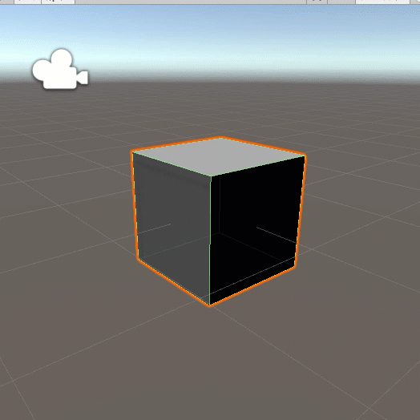

# Collider Component Overview

## Overview

Primitives \(shapes\) usually have a Collider component by default based on their shape, but you will need to add them to other objects \(including empty ones\) if needed.

## Editing the Collider

Click on the **Edit Collider** button to make the collider and handers visible in the Scene window.

Click and drag the green dots to adjust the size and shape or type in the values within the component in the Inspector.

## Triggers

By default, the collider makes the object be treated as a solid object. Although the default shape and size are the same as the game object, this can be made larger and exist without the mesh, so objects will hit the collider and not go through.

Checking the Is Trigger checkbox turns the collider into a trigger, meaning other objects can go through the boundaries, but it can trigger other events.



## Physic Materials

When you [create a Physic Material asset](../../create/create-assets.md), you can adjust the Bounciness and Friction of the collider.

The Physic Material can be added to the Collider once it's made. Play around with the settings to get the effect you want.

