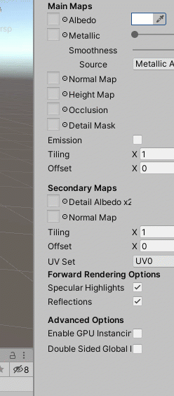

# Update Components in the Inspector

## Overview

When you select a game object in the Hierarchy or an asset in the Project window, the components that control the behavior and appearance are listed in the Inspector.

The white fields are editable.


Changes made while in Play Mode will revert back to the values before playing.

You can copy the component and its values in Play Mode, then paste the values or as a new component when no longer in Play Mode.


## Number Fields

These fields uses **integers** and **floating point** numbers.

You can type directly into the field. Press Enter or click off the field to confirm.

For number fields, you can also hover your cursor over the label \(eg. x, y, or z\) to show a double arrow symbol. Click and drag it left or right to adjust the value incrementally.

Some of these are displayed as specific ranges with a slider.

## Object Fields

These fields will often be "None" for their default followed by the type of component it is looking for. 

There are two ways to update these in the Inspector:

1. Click and drag objects from the Hierarchy or Project window into the field
2. Click on the circle/target icon to the right of the field for a list of objects and assets that match the required type.


If there is a reference an object in the script and the Inspector field is empty and the script doesn't assign the variable, you will get a common error:

_UnassignedReferenceException: The variable \_\_\_\_\_ of \_\_\_\_\_ has not been assigned. You probably need to assign the \_\_\_\_\_ variable of the \_\_\_\_\_ script in the inspector._


## **Checkboxes**

Checkboxes are fields that use booleans \(true or false, 1 or 0\).

Check for TRUE. Uncheck for FALSE.

These fields are great for custom scripts to see if parts of scripts are acting in a specific way \(yes they are or no they aren't\) and when you want to test how something would behave under different switch-like circumstances.

## Dropdown Menus

These are fields with a set list of choices where you can only use one at a time. Click to expand and select the desired value.

## Color Picker

These appear as a color box.

Click the dropper icon to select a color visible on the screen.

Click on the swatch to open the Color window. Select the hue you want from the outer ring, then the value of the color \(lightness/darkness/tint\) in the square.

RGBA \(red, green, blue, and alpha\) values can be added manually in the number fields. Alpha controls the opacity, but only some Materials can be transparent.

Although the default is RGB 0-1.0, there are other options in the dropdown:

**Note:** HSV stands for Hue, Saturation, and Value and is another way that uses numerical values to create a visual color.

The Hexadecimal field will translate "Hex Codes" often used in web development that are six-digit codes starting with a hashtag \# with each digit ranging from 0-9 or A-E.

Close the color window when you are done.





