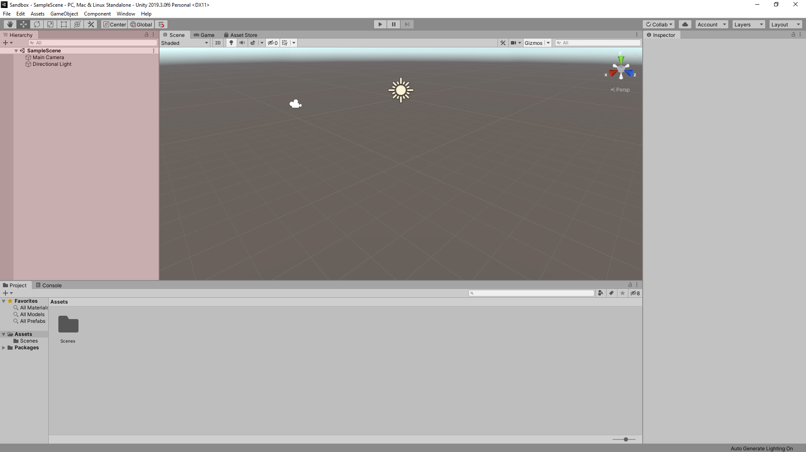
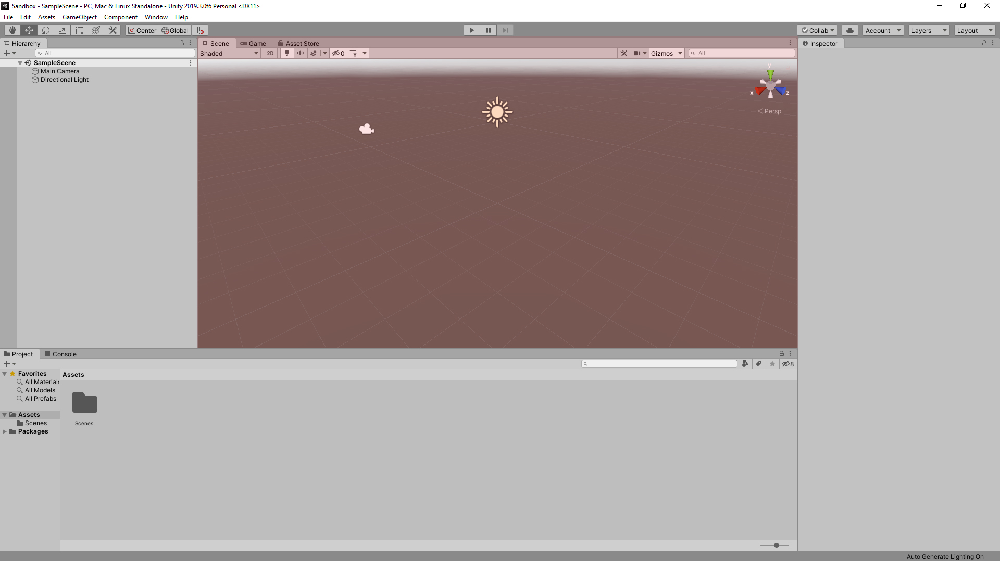
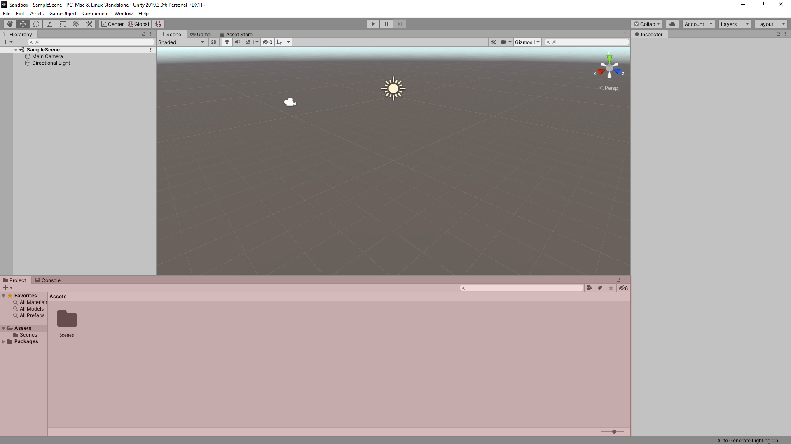
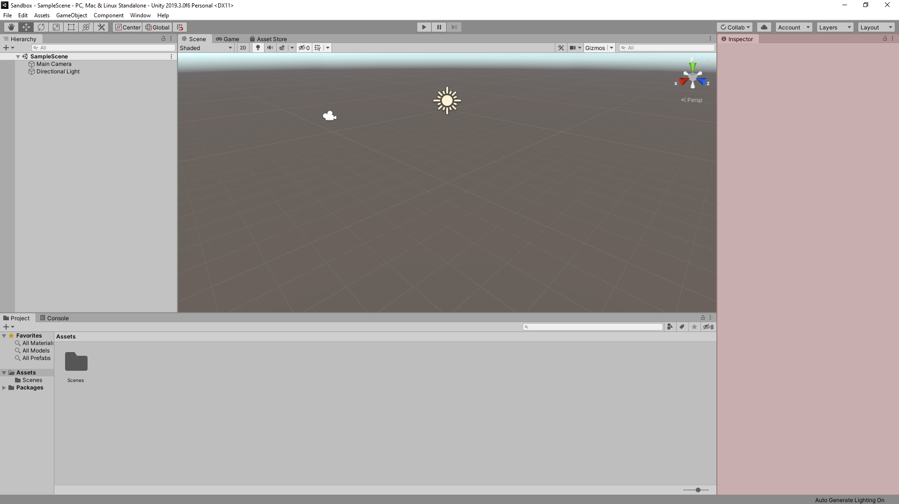
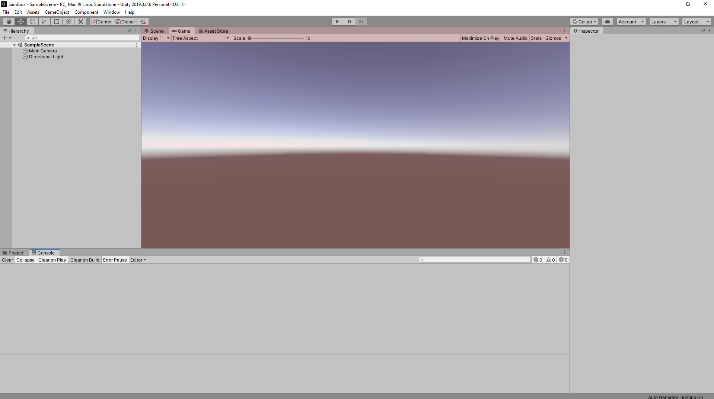
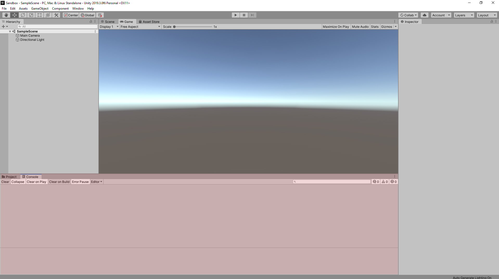

# The Default Interface

## Overview

When opening a new project for the first time, you will see the Default Layout.

This layout provides the most common windows used and in a configuration good for smaller screens. Additional windows can be added through the Window menu in the taskbar.

The windows of the default layout are as follows:

## **Hierarchy Window**

This window shows a text list of game objects within your scene.



## **Scene Window**

This window shows your scene overall. You can move around game objects and change your view.



## **Project Window**

This tab shows the files and folders in the Assets folder of your project and is where all of your assets \(materials, scripts, sounds, prefabs, etc.\) can be accessed.



## **Inspector Window**

One of the most important windows, the Inspector shows all the components and properties of a selected game object or asset.



## **Game Window \(hidden by default\)**

This window shows what the player sees through one of the cameras in the scene.



## **Console Window \(hidden by default\)**

This window provides helpful feedback such as errors, warnings, and other messages.



