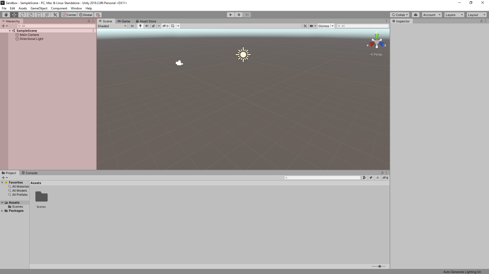
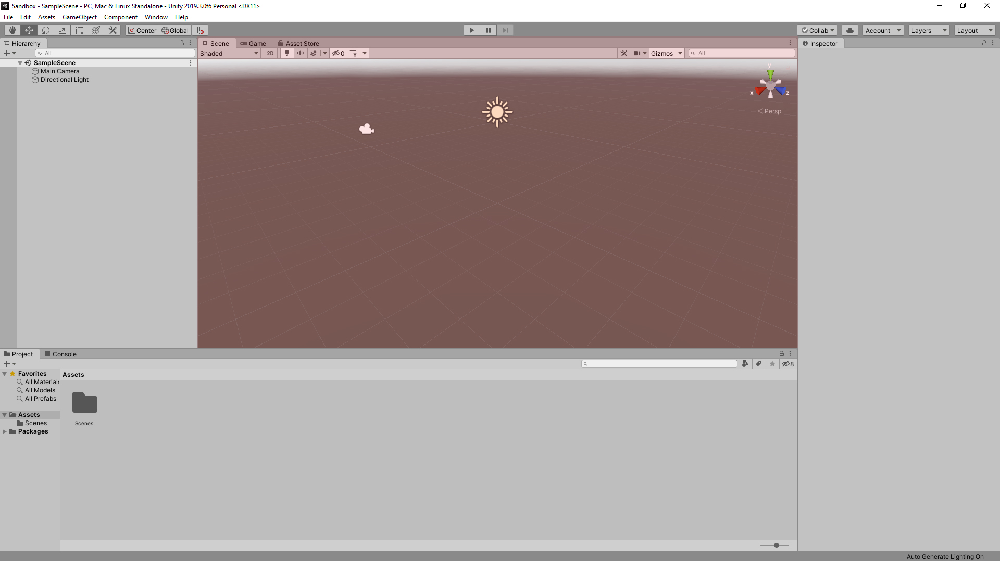
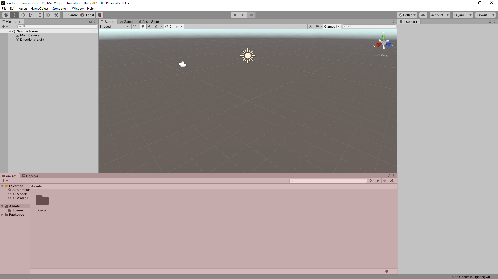
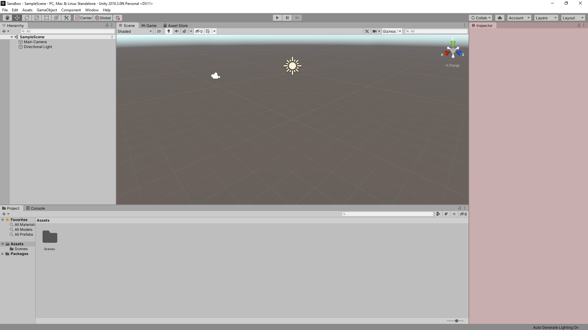
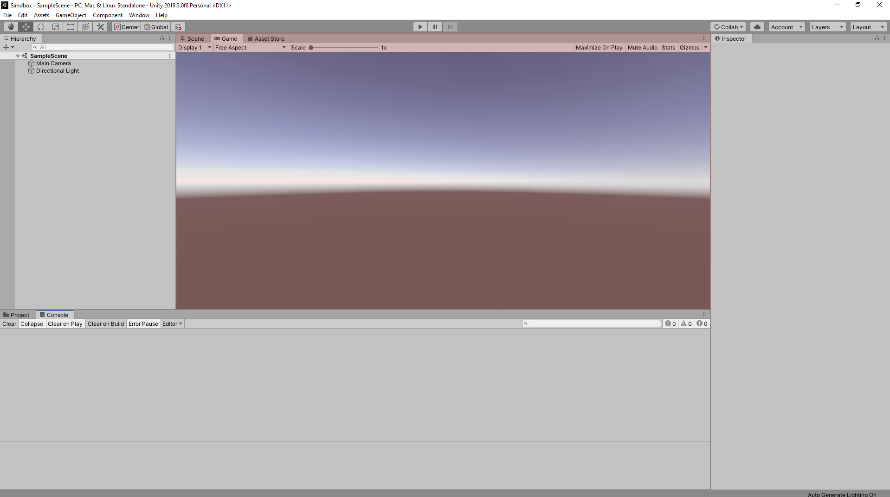
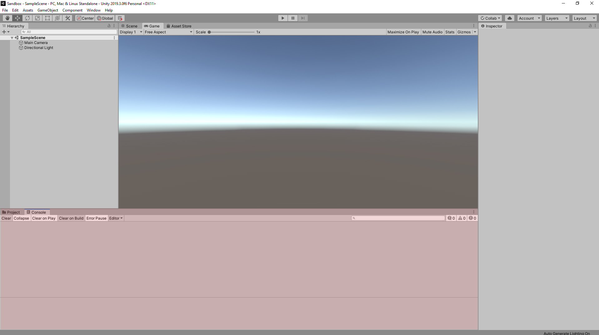

# The Default Interface

## Overview

When opening a new project for the first time, you will see the Default Layout.

.png>)

This layout provides the most common windows used and in a configuration good for smaller screens. Additional windows can be added through the Window menu in the taskbar.

The windows of the default layout are as follows:

## **Hierarchy Window**

This window shows a text list of game objects within your scene.


[hierarchy-tab.md](the-tabs/hierarchy-tab.md)


## **Scene Window**

This window shows your scene overall. You can move around game objects and change your view.


[scene-tab.md](the-tabs/scene-tab.md)


## **Project Window**

This window shows the files and folders in the Assets folder of your project and is where all of your assets (materials, scripts, sounds, prefabs, etc.) can be accessed.


[project-tab.md](the-tabs/project-tab.md)


## **Inspector Window**

One of the most important windows, the Inspector shows all the components and properties of a selected game object or asset.


[inspector-tab.md](the-tabs/inspector-tab.md)


## **Game Window (hidden by default)**

This window shows what the player sees through one of the cameras in the scene.


[game-tab.md](the-tabs/game-tab.md)


## **Console Window (hidden by default)**

This window provides helpful feedback such as errors, warnings, and other messages.


[console-tab.md](the-tabs/console-tab.md)


