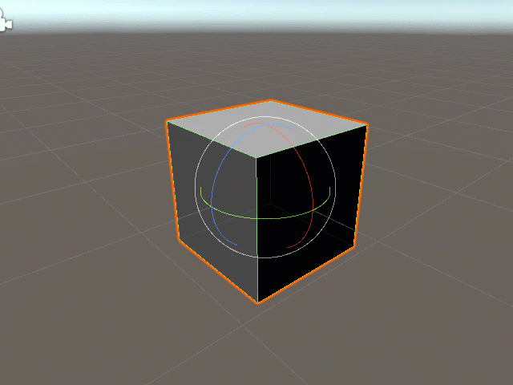
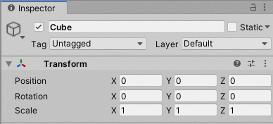

# Rotating Game Objects in the Editor

## Overview

Every game object within a scene listed in the [Hierarchy Tab](../../the-unity-interface/the-tabs/hierarchy-tab.md) has a Transform component shown in the [Inspector Tab](../../the-unity-interface/the-tabs/inspector-tab.md):

Here, we see the rotation's x, y, and z coordinates \(Euler angles\). For rotation, think of a rod going along the axis and the object being spun on it. Generally, the **x-axis** is horizontal, so spinning it moves the object up and down as you are facing it, the **y-axis** is vertical, so spinning it moves the object left and right, and the **z-axis** is forward and back, so moving it moves the object clockwise and counter-clockwise. 

Since you can change the view of your Scene Tab and move cameras with their own transform components, the best way to determine an axis is to move the object with the transform vectors and watch the numbers in the component OR change the numbers and watch the object in the Scene Tab.

## Resetting the Angles

You'll notice when you add a new game object, it will often have Euler angles that aren't \(0,0,0\). Right-click on the Transform component or click the three dots on the right of the component in the Inspector Tab to get this menu:

Here, **Reset** resets all the coordinates to \(0,0,0\) \(position and rotation\) and 1 x 1 x 1 \(scale\) or you can click **Reset Rotation** for just the local rotation of the object in Euler angles.


This will only reset the object's local rotation/Euler angles relative to its parent object. To reset to the game's \(or global\) rotation of 0,0,0, move the object outside of any parent object in the Hierarchy Tab, reset the rotation, then put it back where it belongs. This also updates the local reset rotation to whatever new rotation the object has when placed back into the parent object.


## Rotate Objects in the Scene Tab

Click the **Rotate Tool** at the top left of the editor.

A quick way to select this is to press the **E key** on your keyboard.

This will make rotate vectors appear on the selected object in the [Scene Tab](../../the-unity-interface/the-tabs/scene-tab.md):

You can click and drag on the red, green, or blue vectors to spin/rotate the object around the x, y, or z axes respectively. As you do so, you'll notice the numbers changing in the rotation property in the Transform component.

## Rotation Objects in the Inspector Tab

Just like in all components with number properties, you can adjust numbers by clicking and dragging your cursor over the property name. You must first hover over the property name \(X, Y, or Z\) to make arrows appear around the cursor. Once your cursor moves out of frame, it will reenter on the other side. The numbers should increase and decrease and you should notice the object moving in the Scene Tab.

In the Transform component, you can also type in the exact angles you need. The object's rotation will match.

