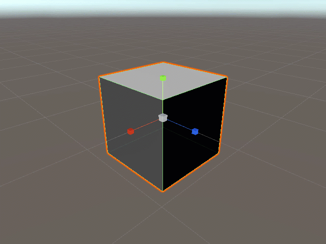
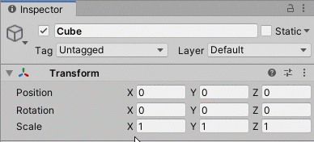

# Resizing/Scaling Objects in the Editor

## Overview

Every game object within a scene listed in the [Hierarchy Tab](../../the-unity-interface/the-tabs/hierarchy-tab.md) has a Transform component shown in the [Inspector Tab](../../the-unity-interface/the-tabs/inspector-tab.md):

Here, we see the local scale's x, y, and z sizes in game units. For scale, the objects will grow and shrink from the middle unless otherwise specified by the developer. Generally, the **x-axis** is horizontal, the **y-axis** is vertical, and the **z-axis** is forward and back.

Since you can change the view of your Scene Tab and move cameras with their own transform components, the best way to determine an axis is to move the object with the transform vectors and watch the numbers in the component OR change the numbers and watch the object in the Scene Tab.

## Resetting the Size

You'll notice when you add a new game object, it will often have a size that isn't 1 x 1 x 1. Right-click on the Transform component or click the three dots on the right of the component in the Inspector Tab to get this menu:

Here, **Reset** resets all the coordinates to \(0,0,0\) \(position and rotation\) and 1 x 1 x 1 \(scale\) or you can click **Reset Scale** for just the local scale of the object in game units to 1 x 1 x 1.


This will only reset the object's local scale relative to its parent object. To reset to the game's \(or global/lossy\) scale of 1 x 1 x 1, move the object outside of any parent object in the Hierarchy Tab, reset the scale, then put it back where it belongs. This also updates the local reset scale to whatever new size the object has when placed back into the parent object.


## Resize Objects in the Scene Tab

Click the **Scale Tool** at the top left of the editor.

A quick way to select this is to press the **R key** on your keyboard.

This will make scaling vectors appear on the selected object in the [Scene Tab](../../the-unity-interface/the-tabs/scene-tab.md):

You can click and drag on the red, green, or blue vectors \(colored blocks\) to grow and shrink the object along the x, y, or z axes respectively. As you do so, you'll notice the numbers changing in the scale property in the Transform component.

Click and drag where the axes intersect to resize the entire object.

## Resizing Objects in the Inspector Tab

Just like in all components with number properties, you can adjust numbers by clicking and dragging your cursor over the property name. You must first hover over the property name \(X, Y, or Z\) to make arrows appear around the cursor. Once your cursor moves out of frame, it will reenter on the other side. The numbers should increase and decrease and you should notice the object growing and shrinking in the Scene Tab.

In the Transform component, you can also type in the exact size in game units you need. The object's size will match.


Make sure all values for Scale are positive to avoid errors.


