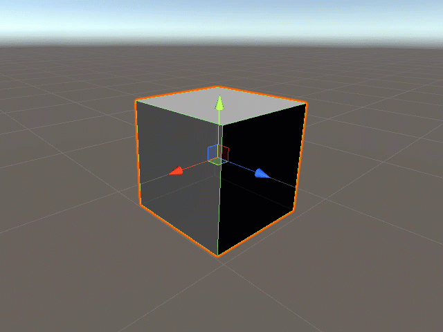

# Positioning Game Objects in the Editor

## Overview

Every game object within a scene listed in the [Hierarchy Tab](../../the-unity-interface/the-tabs/hierarchy-tab.md) has a Transform component shown in the [Inspector Tab](../../the-unity-interface/the-tabs/inspector-tab.md):

Here, we see the position's x, y, and z coordinates. Generally, the **x-axis** is left and right \(horizontal\), the **y-axis** is up and down \(vertical\), and the **z-axis** is forward and back and \(0,0,0\) is the center of the scene. Since you can change the view of your Scene Tab and move cameras with their own transform components, the best way to determine an axis is to move the object with the transform vectors and watch the numbers in the component OR change the numbers and watch the object in the Scene Tab.

## Resetting the Coordinates

You'll notice when you add a new game object, it will often have coordinates that aren't \(0,0,0\). Right-click on the Transform component or click the three dots on the right of the component in the Inspector Tab to get this menu:

Here, **Reset** resets all the coordinates to \(0,0,0\) \(position and rotation\) and 1 x 1 x 1 \(scale\) or you can click **Reset Position** for just the local position of the object.


This will only reset the object's local position relative to its parent object. To reset to the game's \(or global\) position of \(0,0,0\), move the object outside of any parent object in the Hierarchy Tab, reset the position, then put it back where it belongs. This also updates the local reset position to whatever new position the object has when placed back into the parent object.


## Move Objects in the Scene Tab

Click the **Move Tool** at the top left of the editor.

A quick way to select this is to press the **W key** on your keyboard.

This will make translate vectors appear on the selected object in the [Scene Tab](../../the-unity-interface/the-tabs/scene-tab.md):

You can click and drag on the red, green, or blue vectors to move the object along the x, y, or z axes respectively. As you do so, you'll notice the numbers changing in the position property in the Transform component.

Use the squares where the axes intersect to move an object along two axes at once.

## Moving Objects in the Inspector Tab

Just like in all components with number properties, you can adjust numbers by clicking and dragging your cursor over the property name. You must first hover over the property name \(X, Y, or Z\) to make arrows appear around the cursor. Once your cursor moves out of frame, it will reenter on the other side. The numbers should increase and decrease and you should notice the object moving in the Scene Tab.

In the Transform component, you can also type in the exact coordinates you need. The object will appear there.

